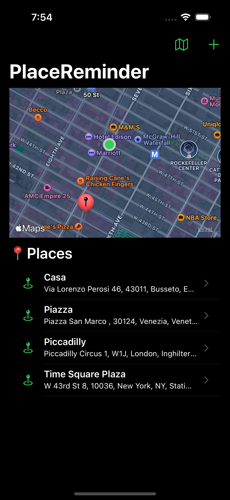
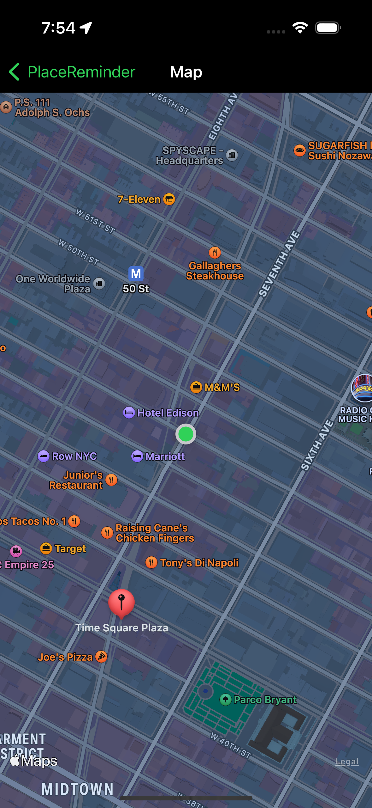
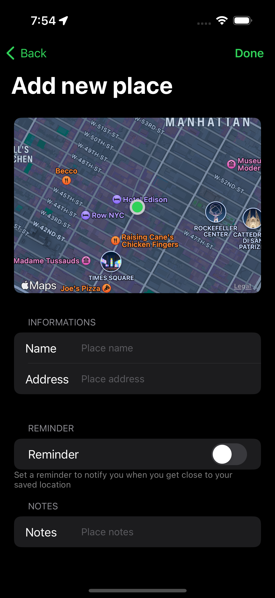
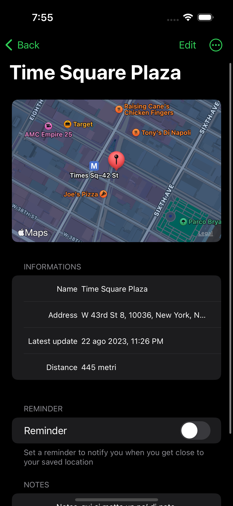

# PlaceReminder

PlaceReminder is a simple iOS application written in Objective-C that allows you to save places of interest and be notified when you are near one of these.

## Index

- [PlaceReminder](#placereminder)
  - [Index](#index)
  - [Functionality](#functionality)
    - [Future developments and improvements](#future-developments-and-improvements)
  - [Installation](#installation)
  - [Usage](#usage)
  - [Project structure](#project-structure)
    - [Databases](#databases)
    - [MapKit](#mapkit)
      - [Geofencing](#geofencing)

## Functionality

- A user can save a placeholder featuring:

  - Geographic coordinates and address
  - Name and optionally a description
  - Date and time of addition

- Placeholders can be viewed in a list sorted by date added and in a map through markers on it.
- Pressing a marker on the map displays a callout with general information and gives the possibility to view all the details
- Placeholders can be deleted by the user and modified at will
- More information can be read from Apple Maps
- When the user enters the region of a reminder, he is notified with a message that he has entered the region

### Future developments and improvements

Upcoming features to be implemented:

- [ ] Addition of categories for places (e.g. work, home, school, etc.)
- [ ] Adding photos for saved places
- [ ] Ability to record a voice note for each saved place
- [ ] Ability to change the geographic region radius for each saved place

## Installation

In order to install the application on your device, you need a version of iOS 16.4 or higher and a simulator or physical device with this version of iOS installed. You also need to have Xcode 14 or higher installed.

<!-- In case you don't have these tools, you can try the application by subscribing to the beta channel on TestFlight. -->

## Usage

When started, the application will present a map in which the user's position will be displayed. At the top there are two buttons: one to add a new place to the list of saved places and one to view the map in full screen.

<!-- Put home screen image and map -->



In the screen for adding a new place it is possible to enter the name of the place and the address that you want to store; this information is strictly necessary, otherwise it will not be possible to save the place. Furthermore, it is possible to add a reminder for the place, which consists of a notification that will be delivered to the device when you approach the marked place, and some notes that can be useful to remember why you saved the place .

The address can also be filled in only partially (for example, it is possible to insert only the name of the street and the city, or the name of the place...) because the missing information will be automatically retrieved through Apple Maps.



In the map view screen and homepage, you can select a saved place to view its information. In particular, you can view the place name, address, notes and memo, if any, as well as the date that place was added. Additionally, you can delete the place from your Saved Places list, view more information within Apple Maps, and edit the place's information.

<!-- Put place view screen image -->


> **NOTE:** all information is not shared with third party services (with the exception of Apple Maps for the geocoding and reverse geocoding service) and is saved locally on the device.

## Project structure

The project was developed using the MVC (Model-View-Controller) pattern. The data (model) faithfully reproduce what is reported in the database and the files representing the entities have been automatically generated by Xcode through the command `Editor > Create NSManagedObject Subclass...`.

The display part was developed using Storyboard and AutoLayout. The application is managed by a `NavigationController` which allows you to manage the navigation between the various screens. The screens that make up the application are as follows:

- `HomePageViewController`: main screen of the application, contains the map and the list of saved places. The screen consists of a `ViewController` inside which there is an `MKMapView` and a `UITableView`. The map was implemented using the `MapKit` framework and the list of places was implemented using a `UITableViewController` with dynamic type cells. In the navigation bar there are two buttons: one to add a new place and one to view the map in full screen.
  - - `AddPlaceViewController`: screen for adding a new place. The screen consists of a `TableViewController` which contains four sections: map view, general information about the place, reminders and notes. The name and address information are essential for saving the place, while the others are optional. The map was implemented using the `MapKit` framework and shows the user's current location; while the cell view was implemented using a `UITableViewController` with cells of static type.
- `PlaceDetailViewController`: screen for viewing the details of a place. The screen consists of a `TableViewController` which contains four sections: general information about the place, reminders, notes and date added. Cell view was implemented using a `UITableViewController` with cells of static type. The map has been implemented using the `MapKit` framework and shows the location of the saved place and, in case the user is near that place, also the user's location indicator. In the navigation bar there are buttons for changing the place data and for viewing more information within Apple Maps and removing the place from the list of saved places.
- `MapViewController`: full screen map display screen. The screen consists of a `ViewController` inside which there is an `MKMapView`. The map shows your current location and saved places. Each saved place is placed on the map with a marker that can be selected to view the general information of the place by going to the detail screen.

### Databases

The database was implemented using Core Data. The database consists of a single entity, `Place`, which contains the following information:

```objc
// PlaceMO+CoreDataProperties.h

@dynamic address; // Address of the place
@dynamic name; // Place name
@dynamic notes; // Notes on the place
@dynamic remember; // Place reminder
@dynamic insert_time; // Place entry date
@dynamic latitude; // Latitude of the place
@dynamic longitude; // Longitude of the place
```

On the add a new place page, `address` is entered by the user and, if it is not complete, it is automatically retrieved from Apple Maps; `latitude` and `longitude` are automatically retrieved from Apple Maps starting from the address entered by the user; `insert_time` is automatically inserted when saving the place. All other information is entered by the user. and can be changed later.

The elements are retrieved from the database through the `fetchPlaces` method of the `PlaceMO` which returns an array of objects of type `PlaceMO` sorted by date of insertion.

```objc
// HomePageViewController.m

- (void)viewDidLoad {
     [superviewDidLoad];
    
     NSManagedObjectContext *context = [[CoreDataManager sharedManager] managedObjectContext];
     NSFetchRequest *fetchRequest = [PlaceMO fetchRequest];
     NSError *error = nil;
     self.places = [[context executeFetchRequest:fetchRequest error:&error] mutableCopy];
    
     if (error) {
         NSLog(@"Error: %@", error);
     }
}
```

### MapKit

The `MapKit` framework was used for displaying the maps. In particular, the `MKMapView` and `MKAnnotationView` classes have been used for displaying the map and the markers. An object of type `CLLocationManager` is initialized within each controller to manage the user's location. In particular, the `requestWhenInUseAuthorization` method is used to ask the user for permission to use the current location and the `requestLocation` method to request the user's current location. Also, the `startUpdatingLocation` method is used to update the user's location in real time.

```objc
// HomePageViewController.m

- (void)viewDidLoad {
     [superviewDidLoad];
     // Set the map view delegate
     self.mapView.delegate = self;
    
     // Create a location manager and set ourselves as the delegate
     self.locationManager = [[CLLocationManager alloc] init];
     self.locationManager.delegate = self;
     [self.locationManager requestWhenInUseAuthorization];
     self.locationManager.desiredAccuracy = kCLLocationAccuracyBest;
     [self.locationManager startUpdatingLocation];

     // ...
}
```

For each object that is retrieved from Core Data an object of type `MKPointAnnotation` is created and added to the map. In particular, the `addAnnotation` method is used to add the object to the map.

```objc
// HomePageViewController.m

- (void)loadPlaces {
     // ...
    
     // Create a point annotation for each place
     for (PlaceMO *place in self.places) {
         MKPointAnnotation *annotation = [[MKPointAnnotation alloc] init];
         annotation.coordinate = CLLocationCoordinate2DMake(place.latitude, place.longitude);
         [self.mapView addAnnotation:annotation];
     }
}
```

#### Geofencing

Through the coordinates of the saved place and those of the user it is possible to calculate the distance between the two points and, if this is less than a certain value, it is possible to notify the user that he is near a saved place.

Notification handling was implemented using the `UserNotifications` framework.

```objc
// AppDelegate.m
- (void) viewDidLoad {
     // ...

     UNUserNotificationCenter *center = [UNUserNotificationCenter currentNotificationCenter];
     [center requestAuthorizationWithOptions:(UNAuthorizationOptionAlert | UNAuthorizationOptionSound | UNAuthorizationOptionBadge) completionHandler:^(BOOL granted, NSError * _Nullable error) {
         if (!error && granted) {
             NSLog(@"User granted notification authorization");
         }
     }];
}
```

For each location saved, we have chosen to create a circular region of radius 500 meters centered on the location itself. This way, when the user is within 500 meters of the place, a notification appears to warn them that they are near a saved place.

```objc
// AppDelegate.m

- (void) viewDidLoad {
     // ...

     CLLocationCoordinate2D coordinates;
    
     for (PlaceMO *place in self.places) {
         coordinates.latitude = place.latitude;
         coordinates.longitude = place.longitude;
            
         // create the geographic region 500 meters wide
         self.geofenceRegion = [[CLCircularRegion alloc] initWithCenter:coordinates radius:500 identifier:place.name];
            
         NSLog(@"Geofence Region created: %@", self.geofenceRegion);
            
            
         // set entry to region as trigger
         if (place.remember){
             self.geofenceRegion.notifyOnEntry = YES;
                        
             // register the geographic region
             [self.locationManager startMonitoringForRegion:self.geofenceRegion];
            
             NSLog(@"Log entry to region: %@", self.geofenceRegion);
         }
     }
}
```

When the user enters the region, a notification appears alerting them that they are near a saved place. Notifications are handled through the `didEnterRegion` method of the `AppDelegate` and use the `UNUserNotificationCenter` for notification display.

```objc
// AppDelegate.m

- (void)locationManager:(CLLocationManager *)manager didEnterRegion:(CLRegion *)region {
    NSLog(@"Entrato nella regione: %@", region);
    
    // recupera il nome del luogo
    NSString *placeName = region.identifier;
    
    // inseriscilo nel titlo della notifica
    NSString *title = [NSString stringWithFormat:@"Sei vicino a %@", placeName];
    NSString *body = [NSString stringWithFormat:@"%@ è luogo importante per te!", placeName];
    
    
    if ([region.identifier isEqualToString:region.identifier]) {
        [self scheduleNotificationWithTitle:title
                                       body:body];
    }
}

- (void) scheduleNotificationWithTitle: (NSString *) title body:(NSString *) body {
    UNMutableNotificationContent *content = [[UNMutableNotificationContent alloc] init];
    content.title = title;
    content.body = body;
    content.sound = UNNotificationSound.defaultSound;
    
    UNTimeIntervalNotificationTrigger *trigger = [UNTimeIntervalNotificationTrigger triggerWithTimeInterval:1 repeats:NO];
    
    UNNotificationRequest *request = [UNNotificationRequest requestWithIdentifier:@"MyNotification" content:content trigger:trigger];
    
    UNUserNotificationCenter *center = [UNUserNotificationCenter currentNotificationCenter];
    [center addNotificationRequest:request withCompletionHandler:^(NSError * _Nullable error) {
        if (error) {
            NSLog(@"Error adding notification request: %@", error);
        } else {
            NSLog(@"Notification request added successfully");
        }
    }];
}
```
